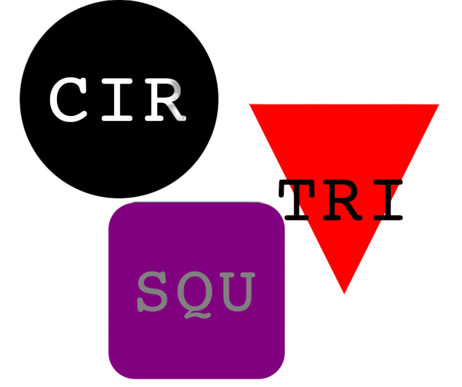

# SVG-logoMaker

## Description
This command-line application creates a logo in an SVG file. Using Node.js, the application allows the user to choose a shape, up to three characters for the logo, and a color for the selected shape and text.

## Table of Contents
  * [Demo](#demo)
  * [Sample-Logos](#Sample-Logos)
  * [Installation](#installation)
  * [Usage](#usage)
  * [Contributing](#contributing)
  * [License](#license)
  * [Questions](#Questions)
<br><br>

## Demo

## Sample-Logos



## Installation
You can install this command-line application in three easy steps:

1. Install Node.js on your computer.
2. Clone this GitHub repository to your local machine.
3. In the terminal, run ```npm install``` to get the necessary dependencies.

## Usage
You can create your own custome logo by doing the following steps:

1. Open a terminal or command prompt, and navigate to the logo makers directory.
2. In the terminal or command line, run ```node index.js```.
3. Answer the series of questions in the terminal or prompt to create a "logo.svg" file.

## contributing
If you would like to contribute to this application, please fork the repo and add any improvments you would like.
## License
[](https://opensource.org/licenses/MIT)
## Questions
Thank you for viewing my command-line application. If you have any questions or would like additional information, you can reach me using the following methods:

GitHub: [xJuanPablo](https://github.com/xJuanPablo) <br>
  Email: pabloarchuleta@gmail.com